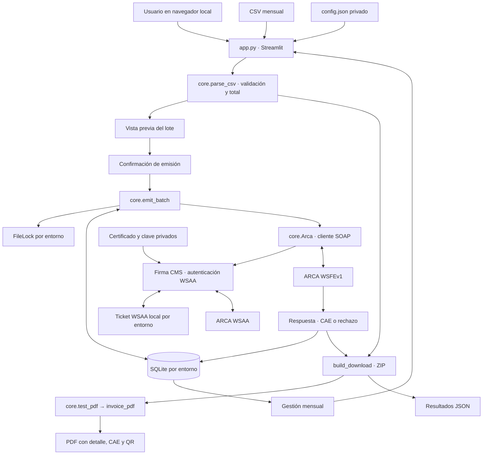
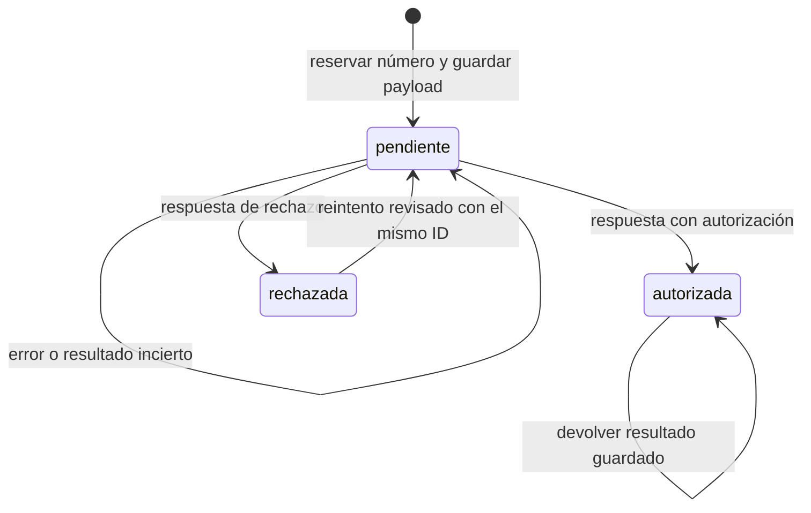

# Arquitectura del facturador

Aplicación local Python. Streamlit presenta el CSV, pide confirmación de emisión y permite descargar comprobantes. El núcleo calcula importes con Decimal y coordina la autenticación y la persistencia.

## Estados del registro

Un pendiente existente impide continuar con nuevos lotes. La consulta `Arca.query` permite investigar el comprobante; no existe una interfaz completa de conciliación. El bloqueo coordina procesos en la instalación local, no otras aplicaciones ni equipos.

Homologación y producción usan endpoints, bases, locks y tickets separados. SQLite registra scope (entorno/CUIT/punto de venta), ID, payload, número, estado y respuesta. Los certificados y la configuración activa se obtienen fuera del repositorio. Los PDF y el ZIP se construyen localmente: cambiar su diseño no requiere una nueva emisión.

## Límites actuales

Factura C, servicios, pesos argentinos y consumidor final. La descripción y los datos de transferencia pertenecen al PDF local; WSFE recibe importes y campos fiscales, no esa descripción como detalle de ítems. El proyecto no incluye servidor multiusuario, nube ni conciliación automática. El diseño del PDF no equivale a una validación legal de sus datos fiscales.
