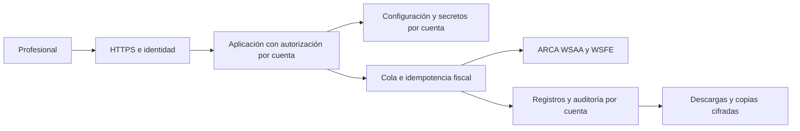

# Servicio web para profesionales

## Base disponible

Docker permite desplegar una instalación por profesional. `compose.hosted.yaml` agrega acceso con contraseña y HTTPS a través de Caddy. La interfaz guía configuración, carga de servicios, revisión, emisión y descarga. Cada instalación tiene un único emisor, datos persistentes y controles de homologación/producción. La descripción del servicio es configurable; no se limita a psicología. El alcance fiscal sigue siendo factura C, servicios en pesos y consumidor final.

Esta es una base para un servicio gestionado: un operador prepara el servidor, dominio, credenciales ARCA y backups; el profesional abre un enlace. La puesta en marcha técnica no se traslada al usuario final. Todavía no hay autoservicio de contratación ni una plataforma compartida de cuentas.

## Evolución a SaaS compartido

Antes de admitir varios profesionales dentro de una misma aplicación se necesitan:

- Identidad con sesiones seguras, recuperación, MFA y autorización por cuenta.
- Separación de configuración, claves, tickets, registros, PDFs y tareas por tenant, con pruebas de aislamiento. El scope fiscal actual no reemplaza autorización de acceso.
- Almacenamiento seguro de secretos y rotación; claves fuera de imágenes, repositorios y logs.
- Base transaccional y cola de emisión con coordinación por entorno/CUIT/punto de venta, idempotencia y conciliación de respuestas inciertas. Un lock local no coordina distintos servidores.
- Auditoría de acciones, control de acceso al soporte, backups cifrados y pruebas de restauración.
- Límites de carga e intentos, monitoreo, actualización de dependencias y revisión de seguridad del servicio.
- Alta guiada de certificados y datos fiscales, estados claros de conexión y soporte para errores de ARCA.
- Condiciones de uso, tratamiento y retención de datos de clientes, exportación y baja de cuentas; cobros y suscripciones si el servicio los requiere.

El diagrama muestra la arquitectura objetivo; no describe componentes ya implementados. No se realizó despliegue público ni emisión real para preparar esta base.

## English

The available deployment is a private installation per professional, optionally protected by Caddy HTTPS and password authentication. A service operator handles infrastructure and ARCA onboarding; professionals use the browser. Each installation retains a single issuer and separate persistent storage.

A shared SaaS still needs identity and per-account authorization, isolation of every credential and artifact, secure secrets management, coordinated issuance workers, idempotency and reconciliation, auditing, encrypted backups, abuse controls, monitoring, onboarding, and data lifecycle management. The fiscal scope key is not an access-control boundary. The diagram is a target architecture, not an implemented multiuser platform.
